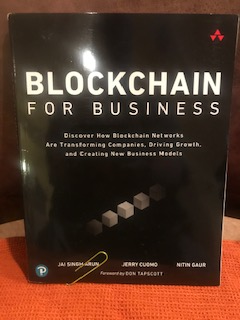

# Blockchain's Potential

Most books on the subject of Blockchain and the associated technology seem to fall into two categories.  The first category is that of a textbook, covering the technical aspects of blockchain programming using Solidity, Python, JavaScript, etc.  The other category seems to focus on theoretical applications and the promise of what blockchain will be able to do in the future.  **Blockchain for Business: Discover How Blockchain Networks Are Transforming companies, Driving Growth, and Creating New Business Models.**, by **Arun, Cuomo, and Gaur.** *Pearson Education, Inc. 2019* is different.  Written by three very senior people from IBM, this book provides an excellent discussion about how to actually plan and design a blockchain strategy for any business use case.

The first few chapters of the book give a general overview of blockchain and how it can have an impact on almost any industry.  The authors give a lot of insight as to how difficult it is to apply blockchain usage in a way that can really capture the power of the technology.  Although early adapters will most likely transfer a traditional business model to a blockchain application, the authors emphasize that there are other business models that should evolve as more applications are developed. One interesting item of discussion is that transactions and micro-payments can occur at the ‘nth’ decimal place.  This might lead to the implementation of business models that are not valuable now but might be in the future. 

## Use Cases For Any Industry
Another topic that I found very interesting was a discussion about the different types of business models and how important they are to the success of a project.  Thinking about the correct business model and also the appropriate type of blockchain structure might be two of the most important things to consider when evaluating a blockchain business proposal.

---
 How Does A Blockchain Work? - Simply Explained

---

Other chapters discuss any industry level requirements might be needed to comply with any legal or regulatory issues.  Other cutting edge technologies such as artificial intelligence, machine learning, or IoT (Internet of Things) can be incorporated into a blockchain project.  The authors provide several use cases throughout the book to bolster their point.

Although this book was written by three high level IBM’ers it didn’t feel like a corporate advertisement.  The processes and methodologies discussed in this book are applicable to whatever platform is being used.  That being said I am definitely interested in learning more about IBM’s Hyperledger blockchain technology.  The authors didn’t discuss other blockchain platforms from companies such as Microsoft Azure, AWS, or Google.  However this did not detract from the book as it was focused more on a broader view.

### Thumbs Up!!! 
This book provides a detailed roadmap of how to proceed in the planning and decision making stage of a blockchain project.  The authors have provided an invaluable resource to anyone involved or interested in knowing more about planning and deploying a blockchain project. Anyone interested in exploring blockchain opportunities and important aspects to consider when planning a new project should read this book!

---

---
